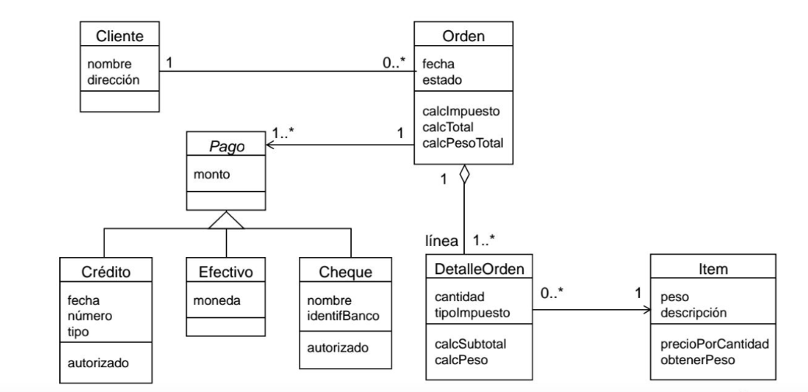

# Curso-Programacion-Orientado-Objetos-UNEMI
curso de Programación orientado a Objetos con Python

Plantilla Inicial Docker, python 3.10 y Django 4.

1. Copiar el contenido del archivo `.env.example` en un nuevo archivo `.env`

2. Ejecutar los siguientes pasos:

        1. docker-compose build
        2. docker-compose run --rm django django-admin startproject app .

3. Habilite las siguientes lineas en archivo `django-backend/Dockerfile` linea 31:

        ENTRYPOINT ["/app/docker/entrypoint.sh"]

4. Vuelva a crear la Imagen Docker

        docker-compose build
        docker-compose up

5. Abre el navegador e ingresa:

        http://localhost:8001/

## Levantando el Servidor Django:

## Caso de estudio - modelo UML de ventas.

